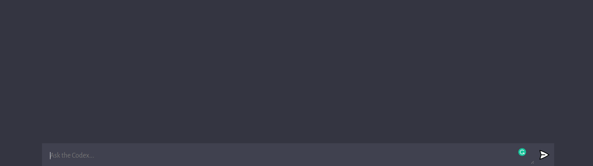

## Ask ChatBot Anything 

### note: in our package json, we added a "type" equal to "module", which allows us to use the imports instead of regular require statements. 
### note: we removed "main": "index.js" from our package.json, because it might conflict the index.js from the server.
####  the presence or absence of the "main" field in the package.json file does not have anything to do with whether you are using the import or require statements in your code.
####  The "main" field in package.json specifies the entry point for your Node.js application. It specifies the file that will be run when you execute the node command followed by the name of your package. For example, if the value of "main" is "index.js", then running node index.js will start the application.
####  The "type" field in package.json specifies the type of the module in your codebase. It can be set to "commonjs" if your code uses the require statement, or "module" if it uses the import statement. This field is used by tools like TypeScript and Babel to determine how to transpile your code.
####  So, if you remove the "main" field from package.json, it means that your package does not have an entry point, and it cannot be run directly with the node command. However, it does not affect the use of import or require statements in your code.